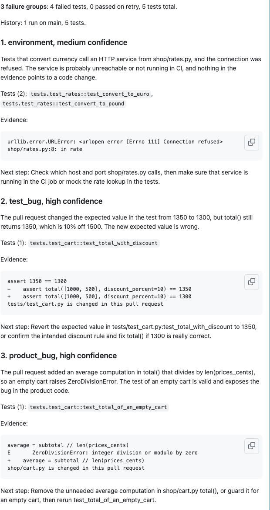

# failtriage

After a CI run, failtriage reads the JUnit or Playwright JSON report, removes secrets and personal data, groups the failures by root cause and classifies each group as `product_bug`, `test_bug`, `flaky`, `environment` or `unknown`. It posts one report on the pull request. Fixed rules go first and an LLM second, and every verdict quotes its evidence.

A red CI run with forty failures rarely has forty causes. Usually it is two or three causes, say a service that was down and one wrong constant. Reading the logs to find that out costs more than the fix. failtriage does the grouping and the first guess, and it shows the lines it based the guess on, so you can check it in seconds.

## Example report

This is group 2 of the 3 that `failtriage analyze --junit tests/fixtures/junit/mixed.xml --markdown` prints with no API key set, so the verdicts come from the rules alone (the report adds a line saying so under each group):

> **3 failure groups**: 3 failed tests, 0 passed on retry, 6 tests total.
>
> History: none. No earlier runs on main were available, so nothing here says a test was stable before.
>
> ### 2. environment, medium confidence
>
> The failure points at the CI environment
>
> Tests (1): `tests/test_api.py::test_fetch_profile`
>
> ```text
> requests.exceptions.ConnectionError: HTTPConnectionPool(host='staging.internal', port=8080): Max retries exceeded
> tests/test_api.py:44: ConnectionError
> ```
>
> Next step: Check the service or setting in the quote, then rerun

This is the comment on a pull request in the [demo repository](https://github.com/dimagrotser/failtriage-demo), with an API key set. The pull request breaks three things at once.



## Try it without your own tests

[failtriage-demo](https://github.com/dimagrotser/failtriage-demo) is a template repository with a tiny app, its tests and this action already wired in. Make a copy, run `scripts/demo.sh all-at-once` and read the comment on the pull request it opens. It works without an API key, with rule-based verdicts only, and a key adds the LLM. The demo README lists what each breakage should produce.

## Quickstart

Add this step after your tests, in a job that has the report on disk:

```yaml
- uses: dimagrotser/ai-test-failure-triage@v1
  if: ${{ !cancelled() }}
  with:
    junit: reports/junit.xml
    anthropic-api-key: ${{ secrets.ANTHROPIC_API_KEY }}
```

Without `anthropic-api-key` the groups are classified by heuristics only.

## Pinning

`@v1` is a floating tag. It moves to each 1.x release, so you get fixes without touching the workflow. If you want a fixed version, use `@v1.0.1`. If your policy asks for immutable references, use the full commit SHA of the release and keep the version in a comment:

```yaml
- uses: dimagrotser/ai-test-failure-triage@<full commit sha>  # v1.0.1
```

Dependabot bumps a SHA or an exact version when a new release comes out. The inputs, outputs and known limits are in the notes of each release in [docs/releases](docs/releases/v1.0.1.md), the inputs and outputs in the [v1.0.0 notes](docs/releases/v1.0.0.md).

## Permissions

The job needs these and nothing more:

```yaml
permissions:
  pull-requests: write  # create and update the report comment
  actions: read         # read history artifacts of earlier runs on main
  contents: read        # check out the repository and read the pull request files
```

The action never runs on `pull_request_target` and stops with an error if you trigger it from there. That event hands a write token to code from a fork.

## Fork pull requests

GitHub gives fork pull requests a read-only token and no secrets, so the action cannot comment there. It detects forks and Dependabot runs, skips the comment and the LLM, and classifies with heuristics only. The full report goes to the job summary of the run. If your workflow drops `pull-requests: write` for another reason, set `comment: false` to get the same behavior.

## Inputs and outputs

| Input | Default | Meaning |
|---|---|---|
| `junit` | none | JUnit XML reports, one path per line |
| `playwright` | none | Playwright JSON reports, one path per line |
| `allure` | none | Allure results directories, one path per line |
| `github-token` | `github.token` | token for the GitHub API |
| `anthropic-api-key` | none | enables LLM classification |
| `model` | `claude-sonnet-5-5` | model that classifies the groups |
| `comment` | `true` | `false` keeps the report in the job summary only |
| `comment-key` | `default` | name of the comment, to keep several per pull request |

Set one of `junit`, `playwright` and `allure`. Several files of one format are fine, for example one report per shard:

```yaml
with:
  playwright: |
    reports/shard-1.json
    reports/shard-2.json
```

The Playwright reporter has to be `json`, for example `npx playwright test --reporter=json > reports/pw.json`.

For Allure, point `allure` at the results directory, usually `allure-results`. The action reads the `*-result.json` files in it, not the HTML report. Attachments are listed by path and never opened. Retries of one test arrive as separate files that share a `historyId`, and they become the attempts of one test.

| Output | Meaning |
|---|---|
| `report` | path of the JSON report |
| `groups` | number of failure groups |

The report is always written to the job summary too. A report that does not fit into a comment is cut there and the whole text stays in the summary.

## History

On runs of `main` the action uploads an artifact called `failtriage-history`. It holds one file, `history.json`: a JSON array with one entry per test in the report, passed tests included.

```json
[{"test_id": "tests/test_fees.py::test_fee", "status": "passed", "attempts": 1, "sha": "3f2c...", "run_id": 9003}]
```

Each entry has exactly these five fields and no text from the report, so there is nothing to redact. `status` is one of `passed`, `failed`, `error`, `skipped` or `passed_on_retry`. `failtriage schema --history` prints the schema, and `history.schema.json` is the committed copy.

Pull request runs never upload it. They read the artifacts of the last 10 runs on main instead, which is why they need `actions: read`. The upload counts as a run of main when `github.ref` is `refs/heads/main` and the event is not `pull_request`, so every other event on main qualifies, a push as much as a scheduled run.

Artifacts expire with your repository's retention setting (90 days by default). Until the first run on main has uploaded one, or when a fork pull request cannot read it, the report says `History: none` and nothing is called flaky from history. If a workflow runs the action in two jobs on main, the second upload fails because the artifact name is taken.

## CLI

```
uv sync
uv run failtriage analyze --junit tests/fixtures/junit/mixed.xml --markdown
uv run failtriage analyze --playwright tests/fixtures/playwright/mixed.json --markdown
uv run failtriage analyze --allure tests/fixtures/allure/mixed --markdown
```

`--junit`, `--playwright` and `--allure` exclude each other and can be repeated for several files or directories of one format.

`uv run failtriage eval evals/` scores the classifier against the labeled failures in `evals/cases/`. With `ANTHROPIC_API_KEY` set it compares the heuristics alone with the heuristics plus the LLM for Sonnet and Haiku, and reports tokens and cost. [docs/lab.md](docs/lab.md) has the details and the current numbers. The `eval` workflow runs it on demand and is never part of CI.

## Accuracy

I scored the classifier on 39 failing runs, 49 failure groups in all. 48 groups come from a small wallet app, and every label there was verified by a counterfactual run, for example by reverting the patch that broke the app ([docs/lab.md](docs/lab.md) explains how). The 49th is a failure from another repository ([docs/adoption.md](docs/adoption.md)), labeled by me. The numbers below come from one run of the `eval` workflow on 2026-10-06, committed as `evals/results/2026-10-06-with-haiku.json`.

| Category | Groups | Heuristics | Heuristics and Sonnet | Heuristics and Haiku |
|---|---|---|---|---|
| product_bug | 17 | 7 | 13 | 16 |
| test_bug | 9 | 2 | 9 | 5 |
| environment | 9 | 8 | 6 | 8 |
| flaky | 7 | 7 | 4 | 4 |
| unknown | 7 | 4 | 4 | 1 |
| all | 49 | 28 (57%) | 36 (73%) | 34 (69%) |

By source, the 40 injected groups score 23 with the heuristics, 31 with Sonnet and 26 with Haiku. The 8 mutation groups score 5, 4 and 7. The one `real` group scores 0, 1 and 1. One group says nothing about accuracy.

Sonnet beats the rules, but the margin comes from the diff. An earlier run of the same dataset, before the LLM got the whole diff for groups whose trace names no changed file, gave Sonnet 27 of 49, one fewer than the rules. The details are in [docs/lab.md](docs/lab.md). The rules do well on `environment` and `flaky`, where Sonnet is worse: it lost 3 of the 7 flaky groups, which have passed-on-retry evidence the rules read correctly. `product_bug` stays the weak spot for the rules at 41%: when a test fails on an assertion, nobody can tell from the log alone whether the test or the product is wrong, so they say `unknown` on purpose. Of its `high` confidence answers Sonnet got 18 of 21 right.

Haiku is two groups behind Sonnet at 37% of the cost, but I would not trust its confidence. It answered `high` for 47 of 49 groups and was right 33 times, 70%. It said `unknown` only twice, so for 6 of the 7 groups that are labeled `unknown` it named a cause anyway. Sonnet's `high` answers hold up better, and it keeps the default. Haiku never worked in the first runs because the request carried an `effort` parameter that Haiku rejects with a 400, see [docs/lab.md](docs/lab.md). With 49 groups, one case moves a category by several points, and I ran Haiku once and Sonnet twice, with 36 right both times.

## Cost

The same run cost $0.37 for Sonnet: 49 calls, 115,016 input tokens and 14,247 output tokens, about $0.0076 per group. Haiku cost $0.14 for the same 49 calls, about $0.0028 per group. A run sends at most 10 groups to the LLM, so a pull request costs up to about $0.07 and usually less, because groups with the same cause are classified once. Every run logs its tokens and cost. Without `anthropic-api-key` it costs nothing and uses the rules only.

## Design decisions

The reasoning behind the choices that are hard to see from the code is in `docs/adr/`:

- [0001](docs/adr/0001-flaky-requires-evidence.md): a group is flaky only with evidence of nondeterminism
- [0002](docs/adr/0002-history-from-own-artifact.md): history comes from an artifact the action uploads on main
- [0003](docs/adr/0003-redact-first-fail-closed.md): redact right after parsing, check again before the LLM call
- [0004](docs/adr/0004-lab-labels-by-counterfactual.md): lab labels are verified by a counterfactual run
- [0005](docs/adr/0005-httpx-for-github-api.md): plain httpx for the GitHub API
- [0006](docs/adr/0006-cluster-before-llm.md): group failures before calling the LLM
- [0007](docs/adr/0007-real-cases-labeled-by-hand.md): real cases are labeled by hand and redacted before they touch the disk

## Limitations

Only JUnit XML, Playwright JSON and Allure result files are read, and Allure steps and attachments do not reach the LLM yet.

Fork pull requests get no comment and no LLM, because GitHub gives them a read-only token and no secrets. The report goes to the job summary and the verdicts come from the rules.

The LLM sees the diff of the pull request files that the stack trace names. When none is named, as in an end-to-end test that only names its own file, it gets the first 150 lines of the whole diff instead. A large pull request can push the relevant file out of those lines, and a diff that has nothing to do with the failure costs tokens and can mislead, as with `environment-ledger-on-every-transfer` in [docs/lab.md](docs/lab.md).

Retries show up in a JUnit report only when the framework writes them down. failtriage reads Surefire's `flakyFailure` and `rerunFailure`, repeated testcases that carry the failure, and the output of `pytest-rerunfailures` and `flaky`, which write a failed attempt as a testcase with no outcome. For those two the failure text is gone, so the flaky group has evidence that the test passed on attempt 2 and nothing else. `pytest-retry` leaves the failed attempt out of the report, so a test it retried looks like a plain pass and is never called flaky from that run.

History has gaps. A repository needs a few runs on main before history signals appear, artifacts expire after the retention period, and fork runs cannot read them. Until then the report says `History: none` and nothing is called flaky from history, so a truly intermittent failure with no retry can come out as `unknown`.

The accuracy numbers are a rough guide. The dataset is small and written by me, it has one real failure, and Sonnet scores 73% on it.
